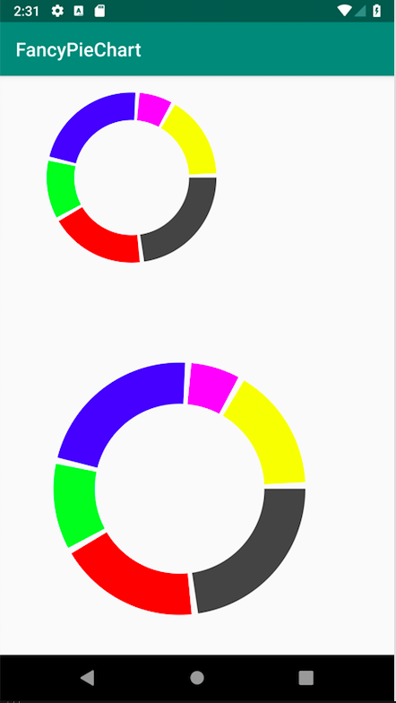
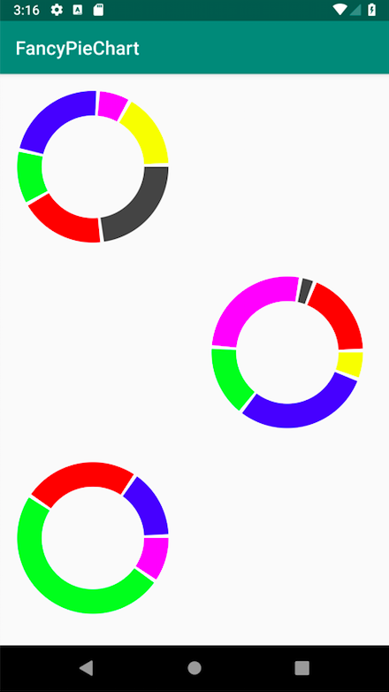

This is simple application used to how to render Pie Chart using Canvas and Paint. It would render the chart according data has been given. Each values are compared with maximum value. The It will be render as degree in PieChart.
setMaximumValue is mandatory to provide without fail.

This is open source. If anyone wants to customise it. You’re welcome!!!!

# Sample Demo:

